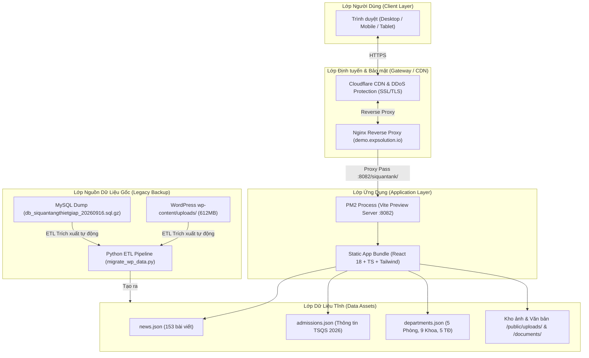
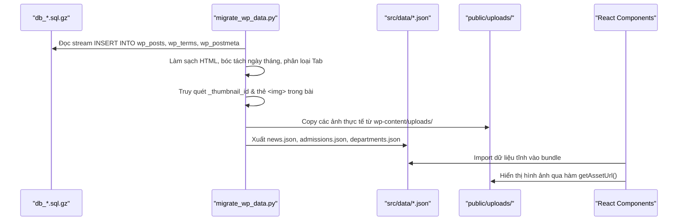

# TÀI LIỆU THIẾT KẾ GIAO DIỆN & TRẢI NGHIỆM NGƯỜI DÙNG (UI/UX DESIGN SYSTEM)
## DỰ ÁN CỔNG THÔNG TIN ĐIỆN TỬ TRƯỜNG SĨ QUAN TĂNG THIẾT GIÁP
**Phiên bản:** 2.0  
**Ngày cập nhật:** 19/09/2026  
**Đơn vị thực hiện:** EXPsolution & Nevir Team  

> [!NOTE]
> Tài liệu này tập trung vào quy chuẩn thiết kế UI/UX, Design Tokens, bảng màu quân đội và cấu trúc thành phần giao diện.
> Về kiến trúc hạ tầng và vi dịch vụ, vui lòng xem [KIEN_TRUC_HE_THONG_ARCHITECTURE.md](file:///home/ubuntu/nevir/siquantank/docs/KIEN_TRUC_HE_THONG_ARCHITECTURE.md).

---

## 1. TỔNG QUAN DỰ ÁN

### 1.1. Bối cảnh & Mục tiêu
Trường Sĩ quan Tăng thiết giáp (Binh chủng Tăng thiết giáp - Bộ Quốc phòng) là trung tâm đào tạo sĩ quan chỉ huy, kỹ thuật binh chủng cấp phân đội bậc Đại học. Website cũ của Nhà trường (`siquantangthietgiap.vn`) vận hành trên nền tảng WordPress truyền thống, chứa lượng lớn tư liệu truyền thống, thông tin tuyển sinh quân sự (TSQS) qua các năm và cơ cấu tổ chức đơn vị.

**Mục tiêu dự án:**
1. **Hiện đại hóa giao diện:** Thiết kế giao diện mang bản sắc quân sự anh hùng, trang trọng, ứng dụng công nghệ web hiện đại (Single Page Application, Server-side rendering/Static generation, micro-interactions).
2. **Bảo tồn & Chuyển giao dữ liệu:** Kế thừa toàn bộ 153 bài viết lịch sử, thông tin tuyển sinh 2026 chính thức, kho ảnh tư liệu và văn bản hành chính từ bản sao lưu CSDL của trường.
3. **Tối ưu trải nghiệm (UX/UI):** Tốc độ tải trang dưới 1 giây, phản hồi mượt mà trên mọi thiết bị (Mobile, Tablet, Desktop), hỗ trợ xem trực tiếp bài viết và tải biểu mẫu tiện lợi.

---

## 2. KIẾN TRÚC TỔNG THỂ HỆ THỐNG

### 2.1. Sơ đồ Kiến trúc Hệ thống (System Architecture)



### 2.2. Phân tầng Kiến trúc (Architectural Layers)
1. **Client / Presentation Layer:**
   - Framework: **React 18 + TypeScript + Vite**.
   - CSS Framework: **TailwindCSS 3.4** kết hợp biến CSS tokens chuẩn Shadcn UI / Radix Primitives.
   - Iconography: **Lucide React**.
2. **Delivery & Deployment Layer:**
   - Production Build: HTML5/CSS3/JS nén tĩnh (Static Pre-bundle).
   - Server Runtime: **Node.js** với tiến trình quản lý **PM2** (`vite preview` port 8082).
   - Reverse Proxy: **Nginx 1.28** định tuyến sub-path `/siquantank/` và cấp phát chứng chỉ HTTPS qua Cloudflare.
3. **Data Pipeline & ETL Layer:**
   - Script phân tích dữ liệu Python sử dụng stream parser để trích xuất trực tiếp từ file SQL nén `gzip` sang JSON schema tiêu chuẩn mà không cần khởi động cụm máy chủ MySQL cồng kềnh.

---

## 3. THIẾT KẾ DESIGN SYSTEM & GIAO DIỆN

### 3.1. Ý tưởng Thiết kế (Design Concept)
Giao diện kết hợp tính **kỷ luật, trang nghiêm của quân đội chính quy** với phong cách **hiện đại, trực quan (Tactical & Command Aesthetic)**.

- **Hoa văn & Texture:** Pattern camo ngụy trang (`pattern-camo`), lưới tọa độ tác chiến chỉ huy (`pattern-tactical`).
- **Khung viền & Góc cạnh:** Sử dụng bo góc tối thiểu (`rounded-sm`), viền sắc nét, tương phản rõ ràng gợi liên tưởng đến giáp thép xe tăng và bản đồ quân sự.

### 3.2. Bảng Màu Thương hiệu (Color Palette)

| Mã Màu / Token | Giá trị HEX | Ý nghĩa sử dụng |
| :--- | :--- | :--- |
| **`Primary` (Xanh Quân đội sẫm)** | `#1c2a1e` / `#131d14` | Màu chủ đạo nền banner, header, tạo chiều sâu quân chủng thiết giáp |
| **`Secondary` (Xanh Ô-liu nhạt)** | `#2c3b2f` / `#e9ece7` | Khối thẻ (cards), nền phân cách khu vực |
| **`Accent / Gold` (Vàng Vinh quang)** | `#d4af37` / `#f5c518` | Huy hiệu, viền điểm nhấn, sao vàng, ngày tháng nổi bật |
| **`Destructive / Red` (Đỏ Cờ Tổ quốc)**| `#c0262b` / `#9b1c1c` | Nhãn tin hot, nút quan trọng, gạch phân cách chủ đề |
| **`Background` (Nền sáng hiện đại)** | `#f8f9f7` | Nền đọc tin bài, tăng độ tương phản và dễ chịu cho mắt |
| **`Foreground` (Chữ văn bản)** | `#1a201c` | Màu chữ chuẩn độ đọc cao (WCAG AAA) |

### 3.3. Kiểu chữ (Typography)
- **Tiêu đề lớn & Khẩu hiệu (Display Font):** Font chữ không chân đậm, tracking rộng, viết hoa trang trọng (`font-display`).
- **Nội dung văn bản (Body Text):** `Inter`, hệ thống font sans-serif tối ưu cho hiển thị văn bản tiếng Việt dài với đầy đủ dấu thanh.

---

## 4. THIẾT KẾ DỮ LIỆU & SCHEMA

### 4.1. Cấu trúc Mô hình Bài viết (`news.json`)
```typescript
interface Article {
  id: string | number;        // ID bài viết gốc từ wp_posts
  title: string;              // Tiêu đề bài viết
  date: string;               // Định dạng DD/MM/YYYY
  rawDate: string;            // Định dạng ISO YYYY-MM-DD HH:mm:ss phục vụ sắp xếp
  category: string;           // Tên danh mục chính (Tuyển sinh, Hoạt động...)
  categories: string[];       // Danh sách các tag / taxonomy
  tab: "admissions" | "school" | "army" | "students"; // Tab phân loại trên giao diện
  excerpt: string;            // Tóm tắt ngắn gọn
  content: string;            // Nội dung HTML gốc
  cleanContent: string;       // Nội dung thuần (Plain text đã bóc tag HTML)
  image: string | null;       // Đường dẫn ảnh đại diện tương đối (/uploads/...)
}
```

### 4.2. Cấu trúc Tuyển sinh Quân sự (`admissions.json`)
```typescript
interface AdmissionsData {
  schoolCode: string;         // "TGH" (Mã trường Sĩ quan Tăng thiết giáp)
  schoolName: string;         // "Trường Sĩ quan Tăng thiết giáp"
  majorCode: string;          // "7860206"
  majorName: string;          // "Chỉ huy - Tham mưu Tăng thiết giáp"
  targetYear: number;         // 2026
  posts: Article[];           // Danh sách bài thông báo xét tuyển 2026
  downloadFormUrl: string;    // "/documents/mau-dang-ky-xet-tuyen.doc"
  summary: {
    criteria: string;         // Tổ hợp xét tuyển A00, A01, C01
    targetCount: string;      // Chỉ tiêu đào tạo
    admissionSteps: Array<{
      step: number;
      title: string;
      desc: string;
    }>;
  };
}
```

### 4.3. Cấu trúc Cơ cấu Tổ chức (`departments.json`)
- **`phong` (5 đơn vị):** Đào tạo, Chính trị, Hậu cần, Kỹ thuật, Tham mưu.
- **`khoa` (9 đơn vị):** Khoa Cơ bản, Khoa Kỹ thuật cơ sở, Khoa Thông tin, Khoa KHXH & Nhân văn, Khoa Vũ khí, Khoa Quân sự chung, Khoa Tham mưu - Phương pháp, Khoa Chiến thuật Tăng - Thiết giáp, Khoa Kỹ thuật xe máy.
- **`tieudoan` (5 đơn vị):** Tiểu đoàn 1, Tiểu đoàn 2, Tiểu đoàn 3, Tiểu đoàn 4, Tiểu đoàn 5.

---

## 5. THIẾT KẾ CÁC MODULE CHỨC NĂNG

### 5.1. Header & Navigation ([Header.tsx](file:///home/ubuntu/nevir/siquantank/src/components/site/Header.tsx))
- **Top Utility Bar:** Định danh cấp trên "BỘ QUỐC PHÒNG — BINH CHỦNG TĂNG THIẾT GIÁP", chuyển nhanh đến mục TSQS 2026.
- **Main Nav:** Logo trường có huy hiệu sao vàng viền đỏ, menu đa cấp (Giới thiệu, Tuyển sinh, Tin tức), hỗ trợ cuộn mượt (smooth scroll) vào các anchor ID (`#tuyen-sinh`, `#tin-tuc`, `#lich-su`, `#co-cau`).
- **Nút CTA:** Kêu gọi hành động nổi bật "Tuyển sinh 2026" gắn hiệu ứng ánh kim vàng (`shadow-gold`).

### 5.2. Hero Section ([Hero.tsx](file:///home/ubuntu/nevir/siquantank/src/components/site/Hero.tsx))
- **Khẩu hiệu truyền thống:** *"ĐÃ RA QUÂN LÀ ĐÁNH THẮNG"*.
- **Visual:** Hình ảnh đội hình xe tăng duyệt binh kết hợp gradient tối và lưới tọa độ chỉ huy.
- **Thông tin mốc:** *"Est. 1965 — 60 năm xây dựng và trưởng thành"*.

### 5.3. Dashboard Tuyển sinh 2026 ([AdmissionsDashboard.tsx](file:///home/ubuntu/nevir/siquantank/src/components/site/AdmissionsDashboard.tsx))
- **Đồng hồ đếm ngược:** Đếm ngược tới kỳ xét tuyển đợt mới theo thời gian thực (Ngày, Giờ, Phút, Giây).
- **3 Chỉ số cốt lõi:**
  1. Mã trường `TGH` & Mã ngành `7860206` (Đại học Quân sự).
  2. Điểm sàn nhận hồ sơ 2026: **18,00 điểm** (Miền Bắc) & **17,00 điểm** (Miền Nam).
  3. Quy trình 5 bước xét tuyển chính quy.
- **Thông báo mới nhất:** 5 bài viết trúng tuyển và hướng dẫn nhập học mới nhất năm 2026 trích xuất trực tiếp từ CSDL.
- **Tải văn bản chính thức:** Nút tải file [mau-dang-ky-xet-tuyen.doc](file:///home/ubuntu/nevir/siquantank/public/documents/mau-dang-ky-xet-tuyen.doc).
- **Modal Chi tiết:** Xem toàn văn nội dung quy định xét tuyển ngay trên trang mà không phải tải lại trang.

### 5.4. Lịch sử Truyền thống & Tổ chức ([HistoryTimeline.tsx](file:///home/ubuntu/nevir/siquantank/src/components/site/HistoryTimeline.tsx))
- **Dòng thời gian (Timeline):** Trình bày 8 cột mốc lịch sử từ ngày 05/10/1959 (thành lập Trung đoàn 202) đến 22/06/1965 (ngày truyền thống) và 30/05/2009 (đón nhận danh hiệu Anh hùng LLVT).
- **Cơ cấu tổ chức Nhà trường:** Tab chuyển đổi trực quan xem chi tiết nhiệm vụ và chức năng của **9 Khoa giáo viên**, **5 Phòng chức năng** và **5 Tiểu đoàn quản lý học viên**.

### 5.5. Tin tức & Sự kiện ([NewsHub.tsx](file:///home/ubuntu/nevir/siquantank/src/components/site/NewsHub.tsx))
- **4 Tab chuyên đề:** Phân loại rõ ràng kèm bộ đếm số lượng bài viết thật:
  - *Tuyển sinh 2026* (114 bài)
  - *Hoạt động Nhà trường* (19 bài)
  - *Tin Quân đội* (12 bài)
  - *Góc học viên* (8 bài)
- **Bố cục Hero Story + Card Grid:** Bài viết tiêu biểu chiếm khung lớn với ảnh tư liệu thật; 3 bài kế tiếp dạng danh sách tương tác kèm ngày tháng rõ ràng.
- **Trình đọc bài viết (Article Reader Modal):** Sử dụng Radix UI Dialog hiển thị ảnh tiêu đề, phân đoạn văn bản rõ ràng, đóng mở tức thì với phím ESC hoặc nút đóng.

---

## 6. THIẾT KẾ QUY TRÌNH DI CHUYỂN DỮ LIỆU (ETL PIPELINE)

Quy trình tự động hóa chuyển đổi dữ liệu từ file backup sang cấu trúc ứng dụng:



---

## 7. BẢO MẬT & HIỆU NĂNG

1. **Hiệu năng vượt trội:**
   - Sử dụng mô hình Static JSON Client-side Rendering giúp thời gian TTFB (Time to First Byte) đạt mức tối thiểu (dưới 50ms qua CDN).
   - Bundle production sau khi nén Gzip chỉ ~521KB cho toàn bộ thư viện và dữ liệu 153 bài viết.
2. **Bảo mật:**
   - Không mở cổng kết nối database trực tiếp ra Internet.
   - Nginx cấu hình chặt chẽ, chặn truy cập vào các file ẩn (`.git`, `.env`), proxy pass nội bộ an toàn.
   - Không có nguy cơ tấn công SQL Injection hay WordPress Plugin Exploit trên giao diện công cộng.
