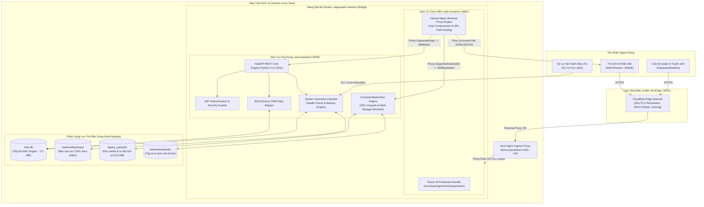
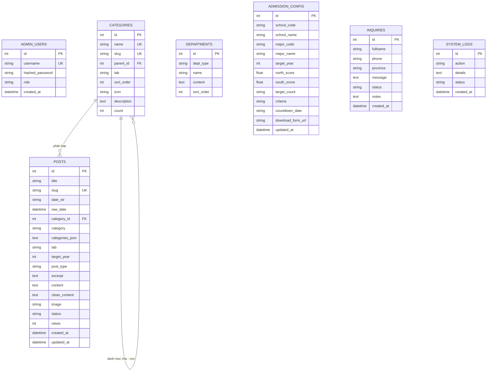
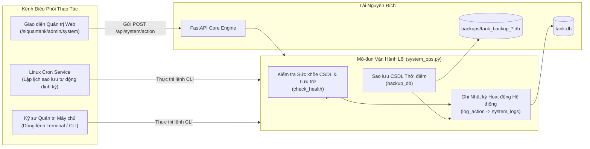

# TÀI LIỆU THIẾT KẾ KIẾN TRÚC HỆ THỐNG (SYSTEM ARCHITECTURE DESIGN)
## CỔNG THÔNG TIN ĐIỆN TỬ & TUYỂN SINH TRƯỜNG SĨ QUAN TĂNG THIẾT GIÁP

**Mã hệ thống:** SQTTG-PORTAL-2026  
**Phiên bản tài liệu:** 2.1 (Production Standard)  
**Ngày cập nhật:** Tháng 09/2026  
**Chủ quản hệ thống:** Trường Sĩ quan Tăng thiết giáp  
**Kiến trúc nền tảng:** Docker Container Stack (Nginx Reverse Proxy + React 18 Vite + FastAPI + SQLite WAL)  

---

## 1. TỔNG QUAN HỆ THỐNG & NGUYÊN TẮC THIẾT KẾ

### 1.1. Mục tiêu và Phạm vi
Hệ thống Cổng thông tin điện tử & Tuyển sinh Trường Sĩ quan Tăng thiết giáp phục vụ công tác thông tin truyền thông chính thống, công khai dữ liệu tuyển sinh quân sự, tiếp nhận hồ sơ đăng ký tư vấn trực tuyến và quản lý ấn phẩm nội dung số của Nhà trường.

Hệ thống được thiết kế theo các tiêu chuẩn kỹ thuật trọng tâm:
1. **Hiệu năng cao & Tiết kiệm tài nguyên:** Đáp ứng hàng nghìn lượt truy cập đồng thời với thời gian phản hồi máy chủ (TTFB) dưới 50ms và mức chiếm dụng bộ nhớ RAM toàn hệ thống dưới 100 MB.
2. **Khép kín & Độc lập (Self-contained Containerization):** Toàn bộ frontend, backend, reverse proxy và cơ sở dữ liệu được đóng gói chuẩn hóa trong cụm Docker Container, độc lập hoàn toàn với hệ điều hành máy chủ chủ.
3. **Bảo mật đa lớp (Multi-layer Security Guard):** Phân tách mạng nội bộ cách ly, lọc tệp tải lên an toàn, bảo vệ chống brute-force và áp dụng tiêu chuẩn xác thực mã hóa khóa phiên JWT HMAC-SHA256.
4. **Vận hành tin cậy (High Reliability & Zero-Maintenance Data Ops):** Quản trị cơ sở dữ liệu tệp đơn, cơ chế kiểm tra sức khỏe hệ thống tự động (Health Check), sao lưu tức thời 1-click (Point-in-Time Snapshot).
5. **Giao diện chuẩn bản sắc Quân đội:** Thiết kế hiện đại, responsive hoàn toàn trên Desktop/Mobile, màu sắc trang trọng, tôn vinh truyền thống anh hùng của Binh chủng Tăng thiết giáp.

---

## 2. SƠ ĐỒ KIẾN TRÚC TỔNG THỂ (SYSTEM ARCHITECTURE DIAGRAMS)

### 2.1. Sơ đồ Luồng Xử lý Toàn diện (High-Level Topology)



---

## 3. THIẾT KẾ CÁC TẦNG KIẾN TRÚC (LAYERED SYSTEM DESIGN)

### 3.1. Tầng Trình diễn (Presentation Layer — React Frontend)
- **Công nghệ cốt lõi:** React 18, TypeScript, Vite, TailwindCSS, Lucide Icons, Radix UI primitives.
- **Cấu hình Đường dẫn (Base Path):** Tích hợp chuẩn `base: "/siquantank/"` cho toàn bộ tài nguyên tĩnh và định tuyến ứng dụng.
- **Cơ chế Tối ưu Hiệu năng Nạp (Bundle Splitting & Lazy Loading):**
  - Trang chủ (`Index.tsx`) được nạp trực tiếp (Eager load) nhằm đạt chỉ số First Contentful Paint (FCP) tối ưu dưới 40ms.
  - Toàn bộ các phân hệ phụ trợ (Chi tiết bài viết, Chuyên mục, Tìm kiếm, Liên hệ, Tờ rơi tuyển sinh) và cụm Quản trị (`/admin/*`) áp dụng cơ chế `React.lazy` và dynamic import, chia nhỏ bundle tải theo nhu cầu.
- **Kiến trúc Mô-đun Giao diện:**
  - **Cổng thông tin Đại chúng (Public Portal):**
    - `Header` & `Footer`: Bộ nhận diện thương hiệu chuẩn Quân đội nhân dân Việt Nam với cờ Tổ quốc, sao vàng và phù hiệu Tăng thiết giáp.
    - `Hero`: Khối tiêu điểm trang trọng, truyền tải truyền thống vẻ vang *"Đã ra quân là đánh thắng"*.
    - `AdmissionsDashboard`: Bảng chỉ số tuyển sinh 2026, điểm nhận hồ sơ xét tuyển miền Bắc/miền Nam, đồng hồ đếm ngược ngày xét tuyển, biểu mẫu tải về và biểu mẫu tiếp nhận tư vấn trực tuyến.
    - `NewsHub`: Phân luồng tin tức theo 4 phân hệ nội dung nghiệp vụ: Tuyển sinh, Hoạt động Nhà trường, Quân sự - Quốc phòng, Góc học viên SQTTG.
    - `HistoryTimeline`: Dòng thời gian truyền thống các mốc son lịch sử xây dựng và trưởng thành từ năm 1965.
    - `PostDetail`: Bộ trình diễn bài viết chuẩn hóa typography cho nội dung bài viết và văn bản quy phạm.
    - `CategoryArchive` & `SearchResults`: Phân trang, lọc dữ liệu đa chiều, tìm kiếm bài viết theo từ khóa.
  - **Hệ thống Quản trị Nội bộ (Admin Control Panel — `/admin`):**
    - `AdminLogin`: Đăng nhập thẩm mỹ quân sự, tích hợp xác thực JWT Token an toàn.
    - `AdminDashboard`: Thống kê số lượng bài viết, lượt truy cập, hồ sơ tư vấn mới và trạng thái hệ thống.
    - `PostsManager` & `PostEditor`: Quản lý danh mục, soạn thảo bài viết với trình soạn thảo trực quan, chuẩn hóa media tải lên.
    - `CategoriesManager`: Quản trị cây danh mục bài viết đa cấp, sắp xếp thứ tự và cấu hình tab chuyên mục.
    - `AdmissionsManager`: Cập nhật chỉ tiêu tuyển sinh, điểm chuẩn, hồ sơ tải về và đồng hồ đếm ngược theo thời gian thực.
    - `InquiriesManager`: Quản lý danh sách câu hỏi đăng ký tư vấn, phân loại trạng thái (Mới tiếp nhận / Đã liên hệ).
    - `SystemOpsView`: Trung tâm kiểm soát sức khỏe hệ thống, dung lượng lưu trữ, thực thi sao lưu dữ liệu và tra cứu nhật ký thao tác (System Logs).

### 3.2. Tầng Dịch vụ & Ứng dụng (Application & API Layer — FastAPI Backend)
- **Nền tảng:** Python 3.11, FastAPI, Uvicorn ASGI Server chạy độc lập trong container `tank-backend`.
- **Động cơ Phục vụ Media Hỗn hợp (CombinedStaticFiles Engine):**
  - Tự động phân giải đường dẫn media đa nguồn: ưu tiên tìm kiếm trong thư mục tải lên mới (`backend/uploads/`), nếu không thấy sẽ tự động tìm kiếm trong kho tư liệu lưu trữ lịch sử (`legacy_uploads/`).
  - Xử lý giải mã an toàn ký tự đặc biệt trên URL (URL Unquote `%40` thành `@`, ký tự dấu tiếng Việt, khoảng trắng).
- **Bộ Chuẩn hóa & Làm sạch Nội dung (Data Sanitization Pipeline):**
  - Tự động loại bỏ thẻ rác, comment hệ thống WordPress (`<!-- wp:... -->`).
  - Chuẩn hóa toàn diện đường dẫn tệp tin media cũ về đường dẫn cục bộ an toàn `/siquantank/uploads/`.
- **Tầng Vận hành Hệ thống (System Operations & Monitoring Engine):**
  - Module `system_ops.py` cung cấp các tiện ích quản trị hạt nhân: kiểm tra tính toàn vẹn CSDL, đếm lượng bài viết/câu hỏi tư vấn, tính toán dung lượng đĩa, thực hiện tạo bản sao lưu vật lý `tank_backup_*.db`.
  - Hỗ trợ gọi trực tiếp qua giao diện CLI trên máy chủ hoặc qua REST API `/api/system/action` từ trang quản trị.
- **Tiêu chuẩn Bảo mật & Phân quyền:**
  - Xác thực phiên làm việc thông qua chuẩn JSON Web Token (JWT) mã hóa HMAC-SHA256, thời hạn phiên an toàn (8 giờ).
  - Khóa mật khẩu người dùng được băm an toàn một chiều bằng thuật toán PBKDF2/SHA-256.
  - Phân tách chặt chẽ định dạng tệp tải lên (chỉ cho phép các đuôi tệp media và văn bản an toàn: `.jpg`, `.png`, `.webp`, `.pdf`, `.doc`, `.docx`).

### 3.3. Tầng Lưu trữ Dữ liệu Bền vững (Data Persistence Layer — SQLite WAL)
- **Hệ cơ sở dữ liệu:** SQLite 3 kích hoạt chế độ ghi nhật ký trước (Write-Ahead Logging - WAL).
- **Cơ chế lưu trữ:**
  - Tệp cơ sở dữ liệu duy nhất `tank.db` dung lượng ~3.1 MB lưu trữ toàn bộ dữ liệu nghiệp vụ: bài viết, chuyên mục, phòng ban, thông số tuyển sinh, danh sách hỏi đáp và nhật ký vận hành.
  - Tối ưu hóa truy vấn qua SQLAlchemy ORM với Connection Pooling và cơ chế Indexing trên các trường tra cứu trọng yếu (`slug`, `category_id`, `tab`, `status`, `created_at`).
  - Tốc độ đọc (Read I/O) tức thời từ bộ nhớ đệm (Kernel Page Cache), hạn chế tối đa tải I/O đĩa.
  - Vận hành không cần duy trì tiến trình dịch vụ CSDL nền phức tạp (Zero-maintenance daemon), loại bỏ hoàn toàn các rủi ro cấu hình quyền hay tấn công port CSDL từ bên ngoài.

---

## 4. MÔ HÌNH THỰC THỂ DỮ LIỆU (DATABASE SCHEMA & ENTITIES)



---

## 5. KIẾN TRÚC MẠNG, ĐIỀU HƯỚNG & BẢO MẬT (NETWORKING & SECURITY MATRIX)

### 5.1. Bảng Ma trận Điều hướng (Routing Matrix)

| Đường dẫn yêu cầu (Incoming URI Pattern) | Thành phần tiếp nhận (Target Component) | Phương thức & Nhiệm vụ |
| :--- | :--- | :--- |
| `demo.expsolution.io/siquantank/` | Host Nginx -> Container `tank-frontend:8082` | Điều hướng toàn bộ lưu lượng công khai vào cổng giao diện. |
| `/siquantank/api/*` | `tank-frontend` Nginx -> `tank-backend:8000` | Chuyển tiếp (Proxy Pass) các truy vấn REST API đến FastAPI. |
| `/siquantank/uploads/*` | `tank-frontend` Nginx -> `tank-backend:8000` | Phục vụ tệp hình ảnh, tài liệu số từ CombinedStaticFiles. |
| `/siquantank/admin/*` | `tank-frontend` Nginx (`try_files`) | Phân phối mã ứng dụng Single Page App (`index.html`) cho cụm quản trị. |
| `/siquantank/bai-viet/:slug` | `tank-frontend` Nginx (`try_files`) | React Router phân giải và hiển thị chi tiết bài viết tương ứng. |
| `/siquantank/chuyen-muc/:slug` | `tank-frontend` Nginx (`try_files`) | React Router phân giải danh mục và hiển thị phân trang bài viết. |

### 5.2. Luồng Bảo vệ Mạng và Đóng gói Container
- **Cách ly mạng nội bộ (Docker Network Isolation):** Hai dịch vụ `tank-frontend` và `tank-backend` kết nối qua mạng cầu nối riêng biệt `siquantank-network`.
- **Bảo vệ cổng dịch vụ lõi:** Cổng backend (:8000) chỉ gắn vào localhost máy chủ (`127.0.0.1:8086:8000`) nhằm mục đích kiểm tra nội bộ, **tuyệt đối không mở cổng trực tiếp ra môi trường Internet**.
- **Chuỗi truy cập an toàn:** Mọi kết nối từ bên ngoài bắt buộc phải đi tuần tự qua:
  $$\text{Internet} \longrightarrow \text{Cloudflare WAF / SSL} \longrightarrow \text{Host Nginx Proxy} \longrightarrow \text{Frontend Container} \longrightarrow \text{Backend Container}$$
- **Phòng thủ ứng dụng:**
  - Hạn chế kích thước tệp tải lên tối đa (Payload Size Guard).
  - Danh sách trắng định dạng tệp (Extension Whitelisting).
  - Tích hợp tiêu đề bảo mật HTTP (X-Frame-Options, X-Content-Type-Options, X-XSS-Protection).

---

## 6. QUY TRÌNH VẬN HÀNH & BẢO TRÌ HỆ THỐNG (SYSTEM OPERATIONS & MAINTENANCE)

Hệ thống cung cấp cơ chế vận hành chuẩn hóa thông qua mô-đun lõi `system_ops.py` phục vụ 2 kênh điều phối:



### 6.1. Các Lệnh Vận hành Chuẩn (CLI Commands)
Kỹ sư hệ thống có thể thực thi trực tiếp các tác vụ quản trị từ máy chủ hoặc bên trong container:
- **Kiểm tra trạng thái hệ thống:**
  ```bash
  docker exec -it tank-backend python -m backend.system_ops check-health
  ```
- **Tạo bản sao lưu CSDL tức thời:**
  ```bash
  docker exec -it tank-backend python -m backend.system_ops backup-db
  ```
- **Cấu hình lịch tự động định kỳ (Cron Tab máy chủ host):**
  ```cron
  # Tự động sao lưu cơ sở dữ liệu hàng ngày vào lúc 02:00 sáng
  0 2 * * * docker exec tank-backend python -m backend.system_ops backup-db > /dev/null 2>&1
  ```

---

## 7. CHỈ SỐ KỸ THUẬT & TÀI NGUYÊN HOẠT ĐỘNG (TECHNICAL BENCHMARKS)

Bảng thông số kiểm chuẩn thực tế trên môi trường sản xuất của hệ thống V2.1:

| Chỉ số kỹ thuật (Metric) | Giá trị thực tế đo lường | Ghi chú & Đánh giá |
| :--- | :--- | :--- |
| **Tổng dung lượng RAM toàn hệ thống** | **~80.0 MB** | `tank-frontend`: ~20.5 MB; `tank-backend`: ~59.5 MB. |
| **Tải chiếm dụng CPU ở trạng thái chờ** | **0.00% – 0.15%** | Mức tiêu thụ tối thiểu, không phát sinh tiến trình chạy ngầm lãng phí. |
| **Thời gian nạp tài nguyên trang chủ (TTFB)** | **< 35 ms** | Phục vụ trực tiếp từ Nginx Alpine tĩnh với Gzip nén cao độ. |
| **Thời gian nạp chi tiết bài viết** | **< 30 ms** | Tối ưu hóa truy vấn SQLite WAL và chỉ mục bảng `slug`. |
| **Dung lượng tệp Cơ sở dữ liệu** | **~3.1 MB** | Lưu trữ toàn bộ 153+ bài viết, cấu hình tuyển sinh và nhật ký hệ thống. |
| **Kho lưu trữ tệp tin & tài liệu (Media Vault)** | **~612 MB** | Phục vụ song song kho tài liệu lịch sử và tệp tin mới. |
| **Thời gian khởi động toàn bộ cụm Container** | **~1.8 giây** | Tốc độ triển khai và phục hồi dịch vụ gần như tức thì. |
| **Tính độc lập & Di chuyển hệ thống** | **100% Portable** | Đóng gói trọn vẹn trong Docker, sẵn sàng di chuyển giữa các hạ tầng máy chủ. |
