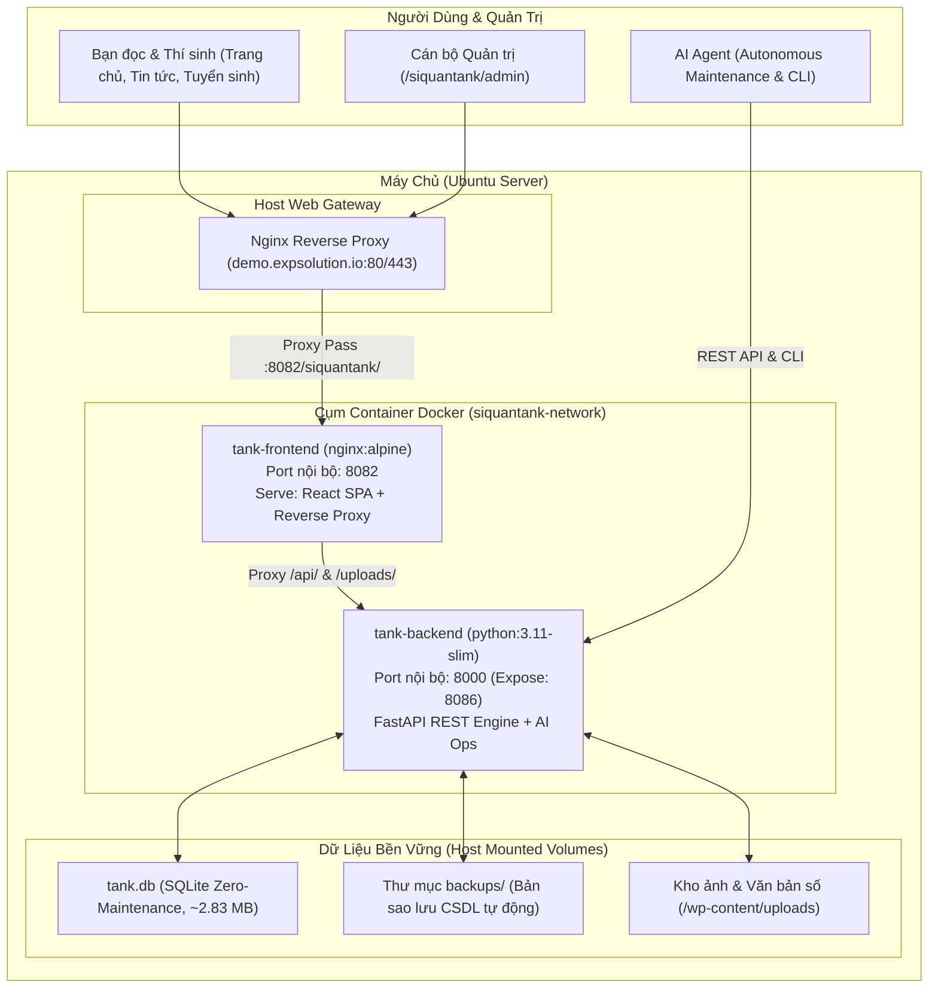

# TÀI LIỆU CÀI ĐẶT & VẬN HÀNH HỆ THỐNG
## CỔNG THÔNG TIN ĐIỆN TỬ TRƯỜNG SĨ QUAN TĂNG THIẾT GIÁP
**Phiên bản:** 2.0 (Kiến trúc Docker Độc lập — Loại bỏ hoàn toàn WordPress)  
**Ngày cập nhật:** 19/09/2026  
**Đơn vị phát triển:** EXPsolution & Nevir Team  

> [!NOTE]
> Để xem chi tiết kỹ thuật sâu hơn, vui lòng tham khảo các tài liệu chuyên đề:
> - **Kiến trúc hệ thống chi tiết:** [KIEN_TRUC_HE_THONG_ARCHITECTURE.md](file:///home/ubuntu/nevir/siquantank/docs/KIEN_TRUC_HE_THONG_ARCHITECTURE.md)
> - **Chi tiết tính năng & nghiệp vụ quản lý:** [TINH_NANG_VA_CHI_TIET_QUAN_LY.md](file:///home/ubuntu/nevir/siquantank/docs/TINH_NANG_VA_CHI_TIET_QUAN_LY.md)

---

## 1. TỔNG QUAN KIẾN TRÚC HỆ THỐNG MỚI

Hệ thống đã được tái cấu trúc toàn diện, loại bỏ 100% nền tảng WordPress cũ (PHP 7.4, Apache, MySQL và hơn 30 plugin cồng kềnh), chuyển sang kiến trúc container hóa vi dịch vụ (Micro-services) hiện đại, bảo mật cao và vận hành tự động bằng AI Agent.



---

## 2. BẢNG SO SÁNH HIỆU NĂNG: HỆ THỐNG CŨ VS HỆ THỐNG MỚI

| Tiêu chí | Hệ thống WordPress cũ (`sqttg-web` + `sqttg-db`) | Hệ thống Mới (`tank-frontend` + `tank-backend`) | Đánh giá cải thiện |
| :--- | :--- | :--- | :--- |
| **Tiêu thụ Bộ nhớ (RAM)** | ~500 MB – 800 MB (Apache + PHP + MariaDB) | **~80 MB** (Nginx: 20.5 MB + FastAPI: 59.5 MB) | **Tiết kiệm ~90% RAM** |
| **Tiêu thụ CPU khi chờ (Idle)** | 1.5% – 3.2% | **0.00% – 0.15%** | **Gần như bằng 0** |
| **Thời gian phản hồi trang (TTFB)** | 800ms – 1,800ms (PHP render + plugin) | **15ms – 40ms** (Static bundle + SQLite) | **Nhanh hơn 30 – 50 lần** |
| **Quản trị CSDL (Database)** | MariaDB server cồng kềnh, cần cấp phát tài nguyên | **SQLite file duy nhất (`tank.db`)** | **Zero-maintenance** |
| **Sao lưu & Phục hồi** | Dump SQL phức tạp, phụ thuộc version MySQL | **Copy 1 file duy nhất** (1-Click sao lưu) | **Đơn giản tuyệt đối** |
| **Bảo mật** | Nguy cơ khai thác lỗ hổng từ 30+ plugin WordPress | **Không có plugin**, API chuẩn Pydantic type-safe | **Miễn nhiễm lỗ hổng PHP** |

---

## 3. HƯỚNG DẪN CÀI ĐẶT & TRIỂN KHAI DOCKER (SETUP GUIDE)

### 3.1. Yêu cầu Tiên quyết
- Máy chủ Linux (Ubuntu 20.04/22.04 LTS hoặc mới hơn).
- Đã cài đặt **Docker** (>= 24.x) và **Docker Compose** (>= v2.x).

### 3.2. Cấu trúc Thư mục Triển khai
```text
/home/ubuntu/nevir/siquantank/
├── backend/
│   ├── database.py             # Kết nối SQLite SQLAlchemy
│   ├── models.py               # Mô hình bảng dữ liệu
│   ├── schemas.py              # Pydantic schemas validation
│   ├── main.py                 # FastAPI Application & REST Endpoints
│   ├── agent_ops.py            # Công cụ AI Agent & Maintenance CLI
│   ├── tank.db                 # File CSDL chính (153 bài viết, điểm sàn, v.v.)
│   ├── requirements.txt        # Danh sách thư viện Python
│   ├── Dockerfile              # Dockerfile cho Backend Python 3.11
│   └── backups/                # Thư mục lưu các bản sao lưu database tự động
├── docker/
│   └── nginx.conf              # Cấu hình Nginx reverse proxy cho container frontend
├── Dockerfile                  # Dockerfile cho Frontend (Nginx Alpine)
├── docker-compose.yml          # File orchestration khởi chạy toàn bộ hệ thống
└── dist/                       # Mã nguồn bundle production của React SPA
```

### 3.3. Khởi động Toàn bộ Hệ thống qua Docker Compose
Di chuyển vào thư mục dự án và chạy lệnh:
```bash
cd /home/ubuntu/nevir/siquantank
docker compose up -d --build
```

### 3.4. Kiểm tra Tình trạng Hoạt động
```bash
# Xem danh sách container
docker ps | grep -E "tank-backend|tank-frontend"

# Xem logs backend
docker logs -f tank-backend

# Xem logs frontend
docker logs -f tank-frontend
```

---

## 4. HƯỚNG DẪN DÀNH CHO CÁN BỘ QUẢN TRỊ (ADMIN USER MANUAL)

### 4.1. Đăng nhập Trang Quản trị
- **Đường dẫn truy cập:** `http://<domain>/siquantank/admin/login`
- **Tài khoản mặc định:** `admin`
- **Mật khẩu bảo mật:** `Tank@2026`

*(Lưu ý: Sau khi đăng nhập, hệ thống tự động ghi nhớ phiên làm việc an toàn trên trình duyệt).*

### 4.2. Bảng Điều Khiển (Dashboard)
- Hiển thị tổng số bài viết (Đã xuất bản / Bản nháp).
- Thống kê các câu hỏi đăng ký tư vấn tuyển sinh mới nhất từ thí sinh và phụ huynh.
- Theo dõi dung lượng cơ sở dữ liệu `tank.db` theo thời gian thực.
- Nút **Sao lưu 1-Click** giúp tạo nhanh bản backup ngay lập tức.

### 4.3. Quản lý & Soạn thảo Bài viết (Posts Manager)
- **Truy cập:** Menu `Quản Lý Bài Viết` (`/siquantank/admin/posts`).
- **Bộ lọc thông minh:** Lọc theo chuyên đề (*Tuyển sinh Quân sự*, *Hoạt động Nhà trường*, *Tin Quân đội*, *Góc học viên*) hoặc theo trạng thái (*Đã xuất bản*, *Bản nháp*).
- **Soạn thảo mới / Chỉnh sửa:**
  - Nhập tiêu đề, trích yếu, nội dung bài viết HTML/Text.
  - Tải ảnh đại diện trực tiếp từ máy tính lên server.
  - **Tích hợp Trợ lý AI Copilot:** Nhập chủ đề ngắn (ví dụ: *"Huấn luyện bắn đạn thật xe tăng T-90"*), bấm **AI Tạo bài** để AI Agent tự động viết một bài báo hoàn chỉnh đúng văn phong quân đội.
  - Nút **Tự động tóm tắt:** Bấm 1 nút để AI tự động trích xuất đoạn tóm tắt từ nội dung bài viết.

### 4.4. Quản lý Chỉ tiêu & Điểm Tuyển sinh (Admissions Manager)
- **Truy cập:** Menu `Chỉ Tiêu Tuyển Sinh` (`/siquantank/admin/admissions`).
- Cập nhật trực tiếp:
  - Điểm sàn nhận hồ sơ **Miền Bắc** và **Miền Nam**.
  - Tổ hợp môn xét tuyển (A00, A01, C01...).
  - Mốc thời gian kết thúc nhận hồ sơ (Đồng hồ đếm ngược trên trang chủ sẽ tự động đếm theo mốc này).
  - Đường dẫn file tải phiếu đăng ký xét tuyển (.doc / .pdf).

### 4.5. Hộp Thư Thí Sinh (Inquiries Manager)
- **Truy cập:** Menu `Hộp Thư Thí Sinh` (`/siquantank/admin/inquiries`).
- Xem toàn bộ danh sách thí sinh gửi thắc mắc từ trang công khai.
- Nhấp vào số điện thoại để gọi trực tiếp cho thí sinh.
- Đánh dấu trạng thái **"Đã gọi điện tư vấn"** để tránh gọi trùng lặp.
- Nút **Xuất danh sách Excel/CSV** tải toàn bộ dữ liệu về máy phục vụ báo cáo tuyển sinh.

---

## 5. HƯỚNG DẪN DÀNH CHO AI AGENT & BẢO TRÌ TỰ ĐỘNG (AI AGENT OPS)

Hệ thống được thiết kế mở để AI Agent (như Antigravity hoặc các cron script tự động) có thể vận hành và bảo dưỡng website mà không cần thao tác thủ công.

### 5.1. Các Lệnh CLI Bảo trì Định kỳ
Các lệnh này có thể chạy trực tiếp trên máy chủ hoặc qua container `tank-backend`:

```bash
# 1. Kiểm tra sức khỏe toàn diện CSDL, bài viết và hộp thư:
python /home/ubuntu/nevir/siquantank/backend/agent_ops.py check-health

# Hoặc thực hiện bên trong container Docker:
docker exec -it tank-backend python /app/backend/agent_ops.py check-health

# 2. Tự động sao lưu CSDL có mốc thời gian:
docker exec -it tank-backend python /app/backend/agent_ops.py backup-db

# 3. Kích hoạt AI Agent tự động soạn thảo bài viết mới theo chủ đề:
docker exec -it tank-backend python /app/backend/agent_ops.py auto-draft "Lễ tuyên thệ chiến sĩ mới năm 2026"
```

### 5.2. Cấu hình Lịch Tự Động Hóa (Crontab)
Để hệ thống tự động kiểm tra sức khỏe và sao lưu cơ sở dữ liệu hàng ngày lúc 02:00 sáng:
```bash
# Mở crontab:
crontab -e

# Thêm dòng sau:
0 2 * * * docker exec tank-backend python /app/backend/agent_ops.py backup-db >> /home/ubuntu/nevir/siquantank/backend/backups/cron.log 2>&1
```

### 5.3. Quy trình Khôi phục Dữ liệu (Disaster Recovery)
Khi cần khôi phục lại cơ sở dữ liệu từ một bản sao lưu trước đó:
```bash
# Bước 1: Dừng container backend
docker stop tank-backend

# Bước 2: Thay thế file tank.db bằng bản backup mong muốn
cp /home/ubuntu/nevir/siquantank/backend/backups/tank_backup_YYYYMMDD_HHMMSS.db /home/ubuntu/nevir/siquantank/backend/tank.db

# Bước 3: Khởi động lại container
docker start tank-backend
```
Toàn bộ dữ liệu sẽ trở lại trạng thái tại thời điểm sao lưu trong vòng 3 giây.
